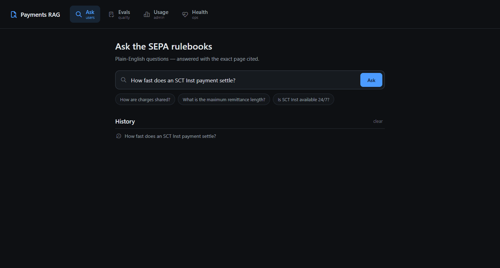
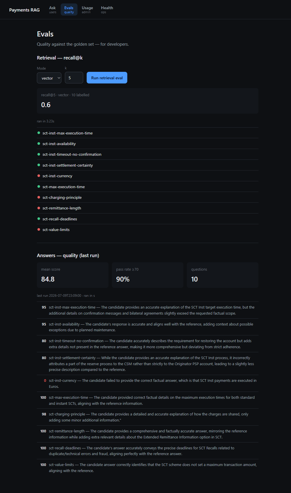
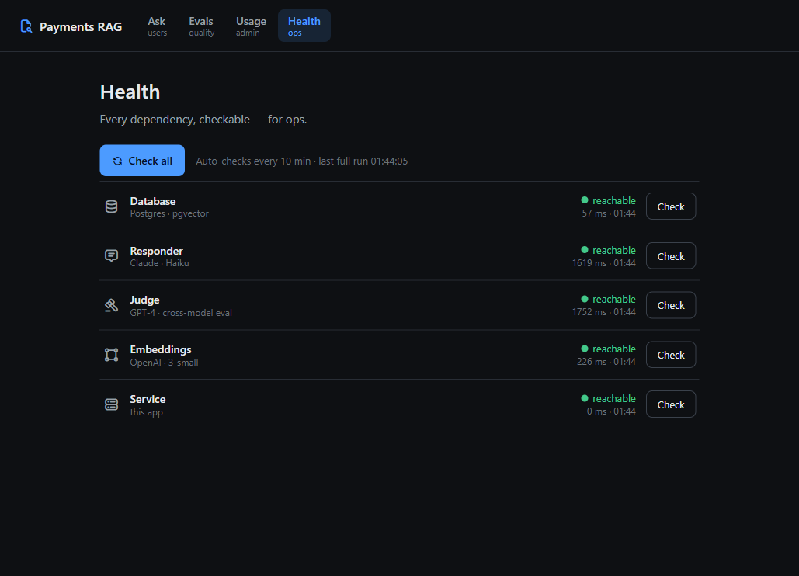

# Payments RAG

Ask the SEPA payment rulebooks in plain English and get a grounded answer with the
**exact page cited** — one click opens that page in the PDF.



A hand-built RAG (no framework) that treats a spec as a first-class source: every
answer is grounded in retrieved passages, cited to a page, **and measured**.
Retrieval is Postgres + pgvector, the responder is Claude, and answers are graded
by a *different* model (GPT‑4) so nothing marks its own homework.

## Highlights

- **Cited answers, click-through to the source.** Each answer links to the exact
  rulebook page (`#page=N`) — verify, don't just trust.
- **Measured, not assumed.** A hand-verified golden set drives `recall@k` for
  retrieval and a cross-model LLM-as-judge for answers, run live in the **Evals**
  view (currently recall@5 = 0.60; answers 84.8 mean / 90% pass).
- **Observable by design.** Per-query timing and token cost on every answer, plus a
  **Health** view that checks all five dependencies (DB, Claude, GPT‑4, OpenAI,
  service) on demand and every 10 minutes.
- **Clean architecture.** An Angular SPA over a FastAPI API over a small,
  framework-free Python core — the core doesn't know a UI exists ([ADR‑0017](docs/adr/0017-frontend-angular-fastapi.md)).
- **A documented decision trail.** 17 ADRs plus writeups explain the *why* behind
  every non-obvious choice ([`docs/adr/`](docs/adr/), [`docs/writeups/`](docs/writeups/)).

## Architecture

Three tiers behind a hard HTTP boundary:

```
Angular SPA (frontend/)  ──HTTP/JSON──▶  FastAPI (api/)  ──▶  Python core (payments_rag/)
                                                              ├─ retrieval  → Postgres + pgvector
                                                              ├─ generation → Anthropic (Claude)
                                                              └─ evals/judge → OpenAI (GPT‑4)
```

The UI has four role-based views — Ask (users), Evals (developers), Usage (admins),
Health (ops):

| Evals — quality is measured | Health — every dependency, live |
|---|---|
|  |  |

## Quickstart

```bash
# 1. Database (Postgres + pgvector)
docker compose -f infra/docker-compose.yml up -d

# 2. Python dependencies
uv sync                       # or: python -m venv .venv && pip install -e .

# 3. Corpus — the EPC rulebooks are public specs. Download them from
#    europeanpaymentscouncil.eu and place them in corpus/raw/ as:
#      corpus/raw/sct_rulebook_2025.pdf
#      corpus/raw/sct_inst_rulebook_2025.pdf
uv run python -m payments_rag.cli index --reset

# 4. API keys
cp .env.example .env          # then fill ANTHROPIC_API_KEY and OPENAI_API_KEY

# 5. Backend  →  http://127.0.0.1:8000  (interactive docs at /docs)
uv run uvicorn api.main:app --reload

# 6. Frontend →  http://localhost:4200
cd frontend && npm install && npm start
```

(Activated a venv instead of using uv? Drop the `uv run` prefixes.)

## Evaluation

Quality is measured, not asserted — and the same numbers show live in the Evals view:

```bash
uv run python -m evals.retrieval_eval     # recall@k over the golden set
uv run python -m evals.answer_eval        # cross-model answer grading (a few paid calls)
uv run pytest                             # unit + DB-integration tests
```

## Scope

A **single, shared service over the public EPC rulebooks** — one deployment for
everyone. It deliberately skips multi-user, auth, and scaling: the corpus is public
and shared, so there is nothing to isolate. Those, plus a live cloud deploy, are
scoped for later — see the [multi-user writeup](docs/writeups/going-public-shared-corpus-rag.md).
Answers are currently retrieval-recall bound (the right page isn't always in the
top‑k; see the [retrieval-quality playbook](docs/retrieval-quality-playbook.md)).

## Repo layout

| Path | What |
|---|---|
| `payments_rag/` | Core: retrieval, orchestrator, adapters, health, query log, CLI |
| `api/` | FastAPI backend (thin HTTP layer over the core) |
| `frontend/` | Angular SPA (the four views) |
| `evals/` | Golden sets + retrieval/answer eval harnesses |
| `docs/` | ADRs, writeups, the retrieval playbook, glossary |
| `infra/` | `docker-compose.yml` + `init.sql` (Postgres + pgvector) |

The decision history lives in [`docs/adr/`](docs/adr/) — the "why" behind most choices.

## License

[MIT](LICENSE) © 2026 Serhiy Kucherenko
