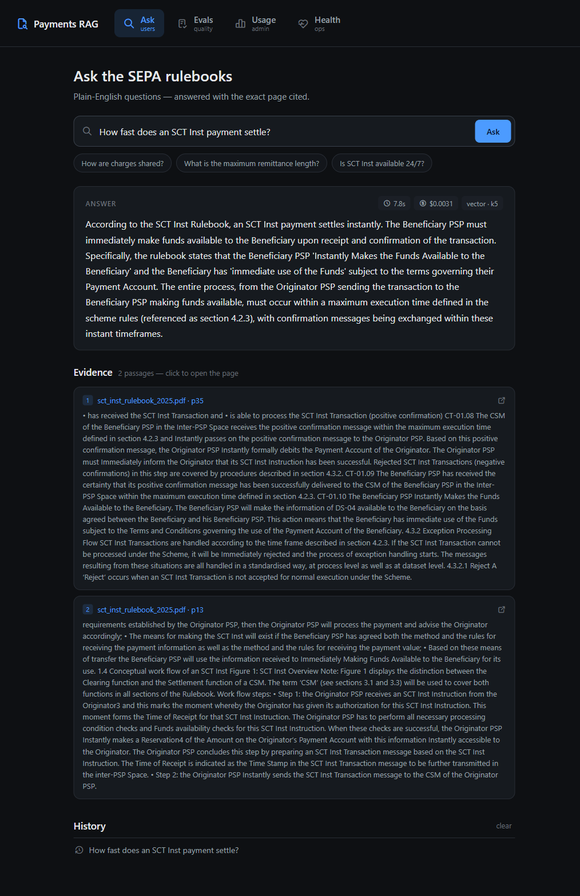
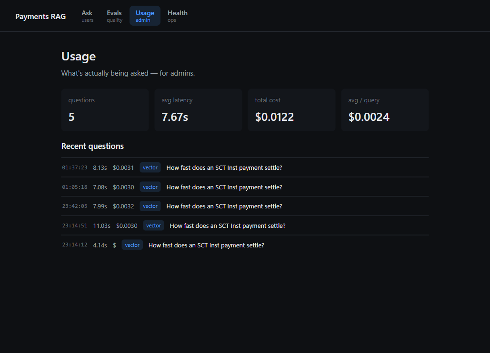

# Payments RAG

A retrieval-augmented Q&A tool for the **SEPA payment rulebooks** (SCT and
SCT Inst). Ask a question in plain English; get a grounded answer with the exact
rulebook page cited — and one click opens that page in the PDF.



Built by hand for learning — a small, honest RAG with its own evals and
observability rather than a framework. Retrieval is Postgres + pgvector; the
responder is Claude; answers are graded by a different model (GPT‑4).

## Scope & limitations (read this)

This is a **single, shared RAG service over public data** — one deployment for
everyone, querying the same public EPC SEPA rulebooks. It **deliberately does not
address multi-user, authentication, or scaling**: there are no per-user documents
(the corpus is public and shared), no accounts, no tenant isolation, and no
rate-limiting yet. Those are conscious deferrals, not oversights — see
[`docs/writeups/going-public-shared-corpus-rag.md`](docs/writeups/going-public-shared-corpus-rag.md)
and the roadmap. Two other honest notes: answers are currently **retrieval-recall
bound** (the right page isn't always in the top‑k — see the
[retrieval-quality playbook](docs/retrieval-quality-playbook.md)), and the app is
**not yet deployed** (runs locally).

## Architecture

Three tiers behind a hard HTTP boundary (see
[ADR‑0017](docs/adr/0017-frontend-angular-fastapi.md)):

```
Angular SPA (frontend/)  ──HTTP/JSON──▶  FastAPI (api/)  ──▶  Python core (payments_rag/)
                                                              ├─ retrieval  → Postgres + pgvector
                                                              ├─ generation → Anthropic (Claude)
                                                              └─ evals/judge → OpenAI (GPT‑4)
```

The UI has four role-based views: **Ask** (users), **Evals** (developers),
**Usage** (admins), **Health** (ops).

## Prerequisites

- **Docker** — for Postgres + pgvector
- **Python 3.14** + [uv](https://docs.astral.sh/uv/) (or a plain venv)
- **Node 24+** — for the Angular frontend
- **API keys** — Anthropic and OpenAI

## Quickstart

```bash
# 1. Database (Postgres + pgvector)
docker compose -f infra/docker-compose.yml up -d

# 2. Python dependencies
uv sync                       # or: python -m venv .venv && pip install -e .

# 3. Corpus — the EPC rulebooks are public specs. Download them from
#    europeanpaymentscouncil.eu and place them in corpus/raw/ as:
#      corpus/raw/sct_rulebook_2025.pdf
#      corpus/raw/sct_inst_rulebook_2025.pdf
uv run python -m payments_rag.cli index --reset

# 4. API keys
cp .env.example .env          # then fill ANTHROPIC_API_KEY and OPENAI_API_KEY

# 5. Backend  →  http://127.0.0.1:8000  (interactive docs at /docs)
uv run uvicorn api.main:app --reload

# 6. Frontend →  http://localhost:4200
cd frontend && npm install && npm start
```

(If you activate the venv instead of using uv, drop the `uv run` prefixes.)

## Evaluation

Quality is measured, not assumed:

```bash
uv run python -m evals.retrieval_eval     # recall@k over the golden set
uv run python -m evals.answer_eval        # cross-model answer grading (a few paid calls)
uv run pytest                             # unit tests
```

Both evals are also surfaced live in the **Evals** view.

## Screenshots

| Evals (developer) | Usage (admin) | Health (ops) |
|---|---|---|
|  |  |  |

## Repo layout

| Path | What |
|---|---|
| `payments_rag/` | Core: retrieval, orchestrator, adapters, health, query log, CLI |
| `api/` | FastAPI backend (thin HTTP layer over the core) |
| `frontend/` | Angular SPA (the four views) |
| `evals/` | Golden sets + retrieval/answer eval harnesses |
| `docs/` | ADRs, writeups, the retrieval playbook, glossary |
| `infra/` | `docker-compose.yml` + `init.sql` (Postgres + pgvector) |
| `corpus/` | Raw PDFs (gitignored) + processed output |

The decision history lives in [`docs/adr/`](docs/adr/); the "why" behind most
choices is there.

## License

[MIT](LICENSE) © 2026 Serhiy Kucherenko
