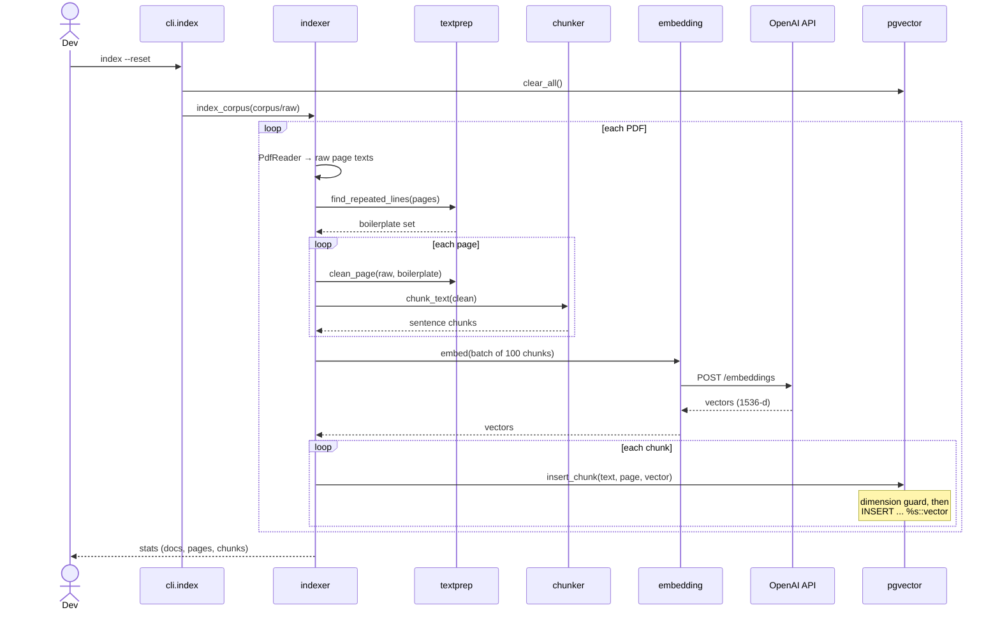
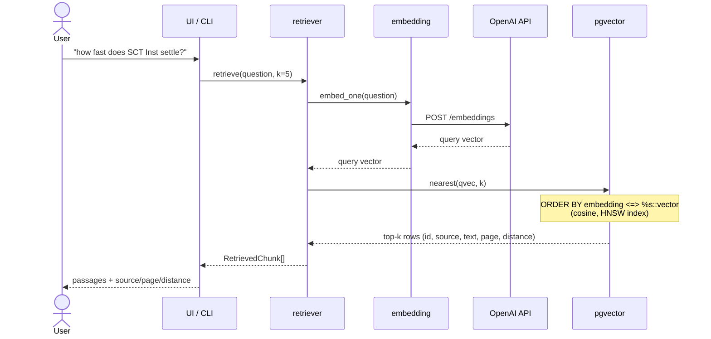
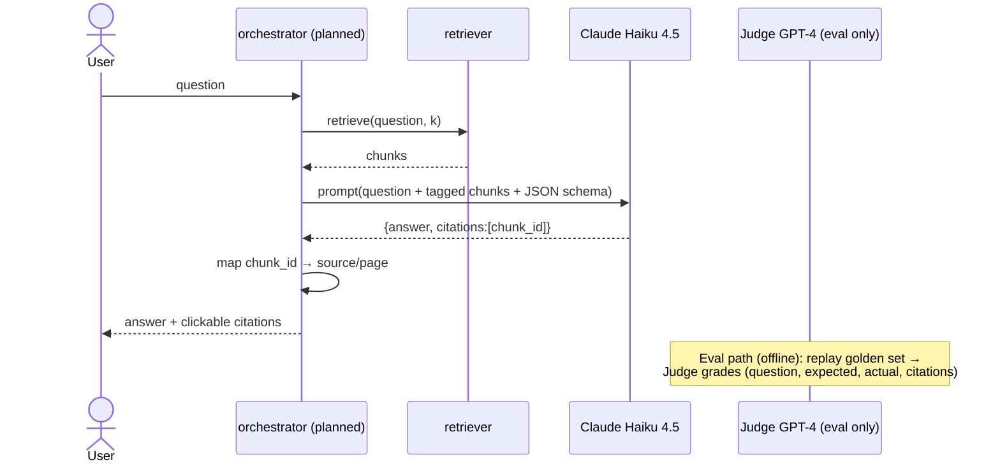

# Architecture

Three independent paths, each running at a different time. Solid = built today;
dashed/"planned" = Week 3+.

## Module map

The package is grouped by concern so the folder tree mirrors the architecture
(ADR-0015): `indexing/`, `retrieval/`, `adapters/`, plus the `orchestrator`.

```
cli.py / ui/streamlit_app.py / smoke_test.py   entry points
        │
        ├── orchestrator.py     answer flow: retrieve → prompt → LLM → cited answer
        │
        ├── indexing/           offline: PDF → clean → chunk → embed → store
        │      ├── indexer.py     CorpusIndexer (the pipeline)
        │      ├── textprep.py    pure: strip repeated header/footer boilerplate
        │      └── chunker.py     pure: sentence-aware split + overlap
        │
        ├── retrieval/          online: question → top-k chunks
        │      ├── retriever.py   vector + hybrid (RRF) retrieval
        │      └── fusion.py      pure: reciprocal rank fusion
        │
        └── adapters/           external services (Ports & Adapters)
               ├── db.py          Postgres + pgvector (KNN + full-text)
               ├── embedding.py   OpenAI text-embedding-3-small
               └── llm.py         Anthropic Claude → structured {answer, citations}

config.py   settings (models, DSN, API timeouts, lazy key validation)
infra/      docker-compose (Postgres+pgvector) + init.sql (schema + HNSW + FTS)
```

Dependencies point inward: entry points → orchestrator → indexing/retrieval →
adapters → config. Nothing in `adapters/` imports the flow layers, and nothing
in the library imports the entry points.

## Path 1 — Indexing (offline, when the corpus changes)



## Path 2 — Query / retrieval (online, per question) — built today



## Path 3 — Answer generation + eval (PLANNED, Week 3)



## Architecture review — is it clear and explicit? Mostly yes.

**Strengths**
- Clean layering; the three paths share exactly one keystone (the embedding
  model) and one store, which is the correct RAG shape.
- Explicit seams: `retriever.retrieve`, `db.nearest`, `embedding.embed` are the
  swap points (e.g. change vector store, change model) — each isolated.
- Pure logic (`chunker`, `textprep`) is separated from I/O, so it's unit-tested.

**Gaps / things to watch (honest list)**
1. **No answer layer yet** — Path 3 is the intended next build. Retrieval is
   proven; generation + citations are not.
2. **No resilience on external calls** — no retry/timeout/circuit-breaker on the
   OpenAI/Anthropic calls. The ~13-min first-batch hang is the symptom. Scheduled
   for Week 4; until then a flaky API blocks the pipeline.
3. **No eval harness** — the single biggest gap for "proof it works" (see below).
   Retrieval quality is currently unmeasured beyond eyeballing.
4. **`nearest` searches the whole table** — no per-document/source filter. Fine
   now; a real need once you want "search only the SCT Inst rulebook."
5. **Minor cohesion nit** — embedding *batching* lives in the indexer, not in
   `embedding.py`. Defensible (the indexer owns throughput), but worth noting.
6. **Dead code** — `clean_page`'s `U+FFFD` replace is a no-op (the artifact was
   misdiagnosed; see ADR 0009). Harmless; remove when convenient.

No major structural flaw. The architecture is appropriately small and the
missing pieces are *known and sequenced*, not accidental.
