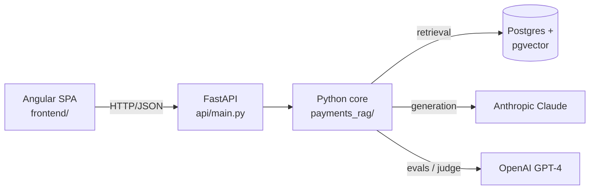
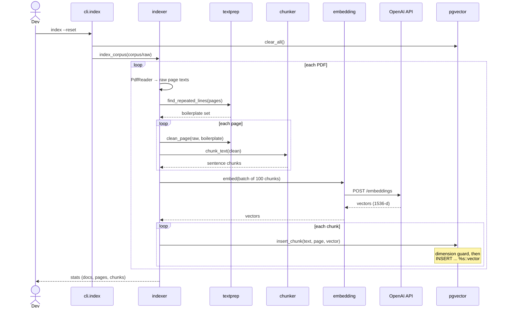
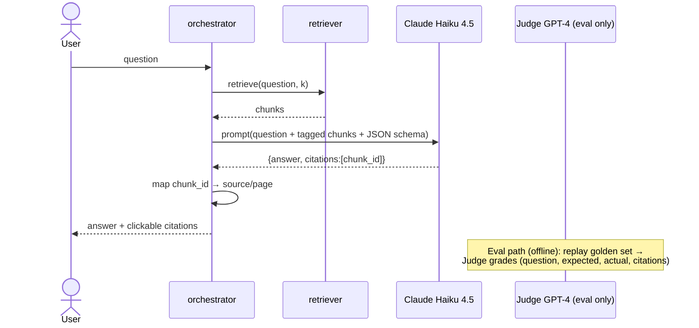

# Architecture

Payments RAG is three tiers behind a hard HTTP boundary: an Angular SPA talks to a
FastAPI backend, which calls a framework-free Python core. The core is where the
RAG actually lives; the API is a thin translation layer, and the UI knows nothing
about pgvector, Claude, or embeddings (ADR-0017).



Everything below is about the **core** (`payments_rag/`), the part worth
understanding. The API and SPA are deliberately thin.

## Module map

The package is grouped by concern so the folder tree mirrors the architecture
(ADR-0015): `indexing/`, `retrieval/`, `adapters/`, plus the `orchestrator`.

```
Entry points
  cli.py                index / query from the terminal
  api/main.py           FastAPI: /ask, /health, /evals, /usage, /source (PDF)
  evals/                retrieval + answer eval harnesses
        │
        ├── orchestrator.py     answer flow: retrieve → prompt → LLM → cited answer
        │
        ├── indexing/           offline: PDF → clean → chunk → embed → store
        │      ├── indexer.py     CorpusIndexer (the pipeline)
        │      ├── textprep.py    pure: strip repeated header/footer boilerplate
        │      └── chunker.py     pure: sentence-aware split + overlap
        │
        ├── retrieval/          online: question → top-k chunks
        │      ├── retriever.py   vector + hybrid (RRF) retrieval
        │      ├── fusion.py      pure: reciprocal rank fusion
        │      └── rerank.py      cross-encoder re-ranking (ADR-0016, eval-only)
        │
        ├── adapters/           external services (Ports & Adapters)
        │      ├── db.py          Postgres + pgvector (KNN + full-text)
        │      ├── embedding.py   OpenAI text-embedding-3-small
        │      ├── reranker.py    cross-encoder model host (ADR-0016)
        │      └── llm.py         Anthropic Claude → structured {answer, citations}
        │
        ├── health.py           per-dependency probes (DB, responder, judge, embed)
        └── query_log.py        per-query telemetry (timing, tokens, cost)

config.py   settings (models, DSN, API timeouts + retries, lazy key validation)
infra/      docker-compose (Postgres+pgvector) + init.sql (schema + HNSW + FTS)
```

Dependencies point inward: entry points → orchestrator → indexing/retrieval →
adapters → config. Nothing in `adapters/` imports the flow layers, and nothing in
the core imports the entry points, which is exactly what lets the FastAPI API and
the CLI reuse the *same* core with no duplication.

## Path 1: Indexing (offline, when the corpus changes)



## Path 2: Retrieval (online, per question)


## Path 3: Answer generation + eval (online, per question)



## Where it stands (honest)

**Solid**
- Clean inward-pointing layering; the CLI and the FastAPI API drive one shared core.
- Pure logic (`chunker`, `textprep`, `fusion`) is separated from I/O and unit-tested.
- External calls have per-attempt timeouts and bounded retries (`config.API_*`),
  added after the localhost/IPv6 hang made the cost of *not* having them concrete
  (see [the-localhost-trap writeup](writeups/the-localhost-trap-windows-ipv6.md)).
- Answers are generated *and measured*: a cross-model LLM-as-judge grades against a
  hand-verified golden set (recall@k for retrieval, correctness/faithfulness for
  answers), so quality is a number, not a vibe.

**Known gaps (sequenced, not accidental)**
1. **Retrieval recall is the current bottleneck.** The right page isn't always in the
   top-k: casual question wording vs. formal spec wording is a vocabulary mismatch.
   The fix stack (multi-query, etc.) is written up in the
   [retrieval-quality playbook](retrieval-quality-playbook.md).
2. **Reranking is eval-only.** A cross-encoder lifts recall (measured 0.60 → 0.70) but
   adds seconds of latency, so it stays out of the live path for now (ADR-0016).
3. **`nearest` searches the whole table**, with no per-document filter yet ("search only
   the SCT Inst rulebook"). Fine at this corpus size.
4. **Single shared service over a public corpus**, so no auth, multi-tenancy, or
   rate-limiting. Deliberate; see the
   [going-public writeup](writeups/going-public-shared-corpus-rag.md).

No major structural flaw. The core is intentionally small, and the missing pieces
are known and sequenced.
